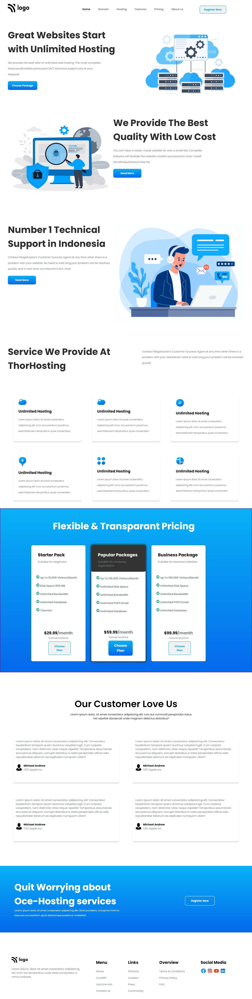

# Project 11 - HTML and CSS

## Murtuza Rangwala

## What I learned from this Project?

- I learned about Variables in CSS.

- I also learned about image properties.

- I also learned about linear-gradient.

- I also learned flex properties.

- I also learned about Grid.

- This project took around 8 hours to complete.

## Live Link of the Project:

[Live Project Link](https://mk-hosting.netlify.app/)

## Output:

